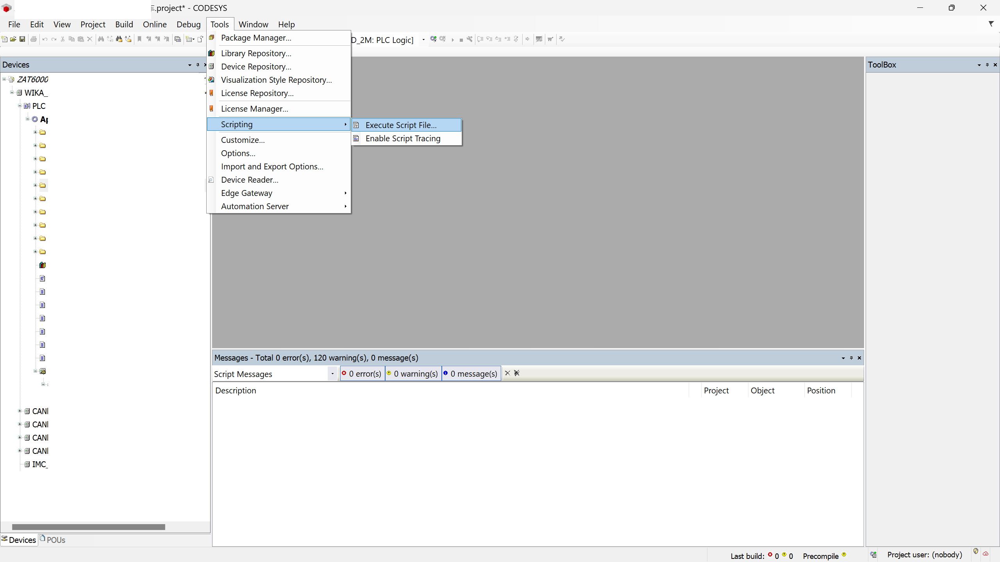
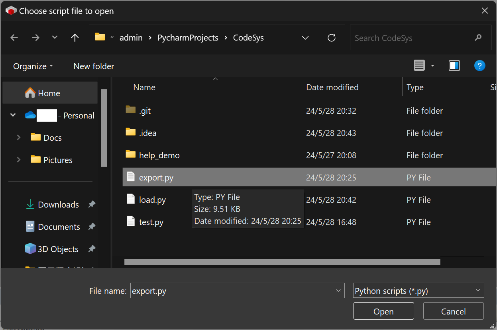
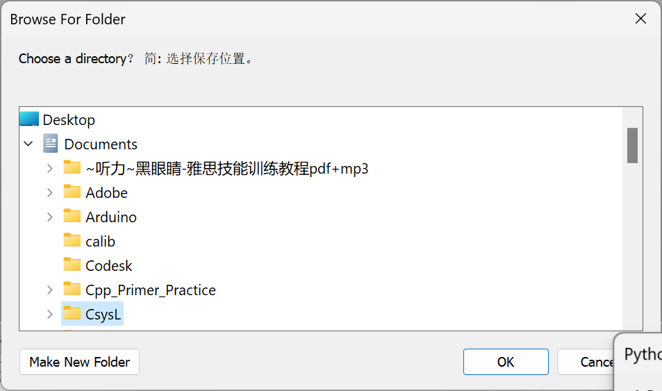
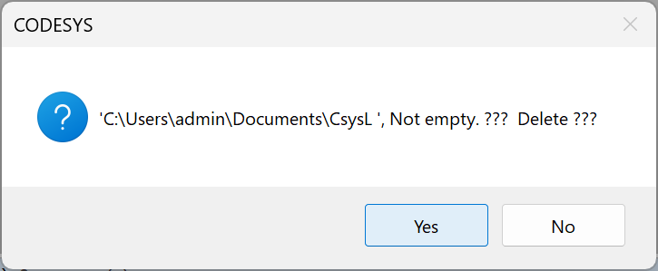
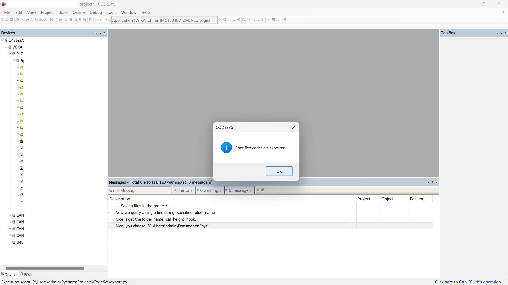
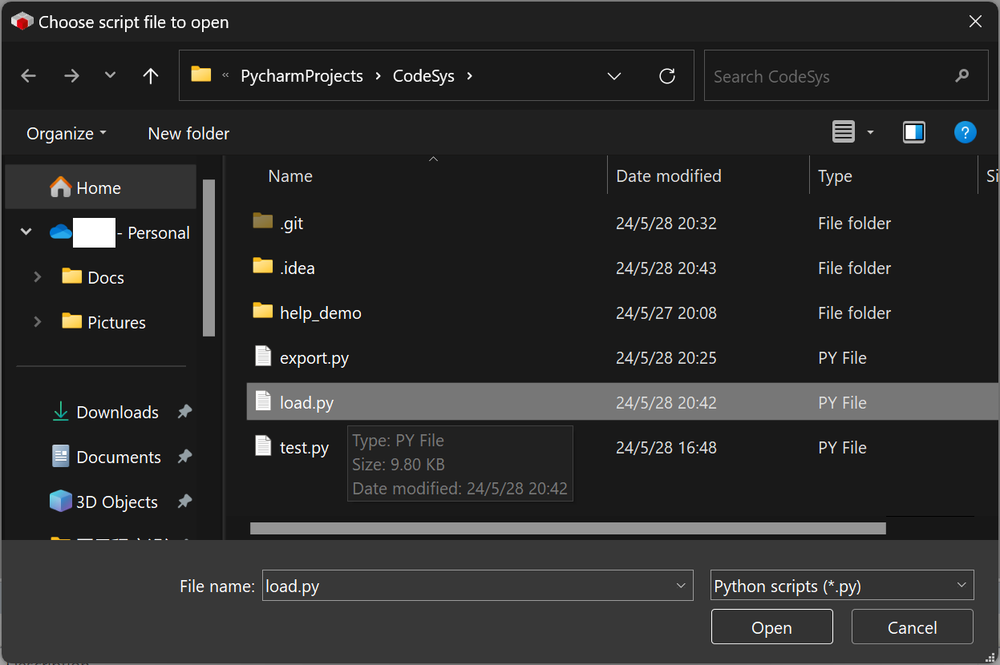
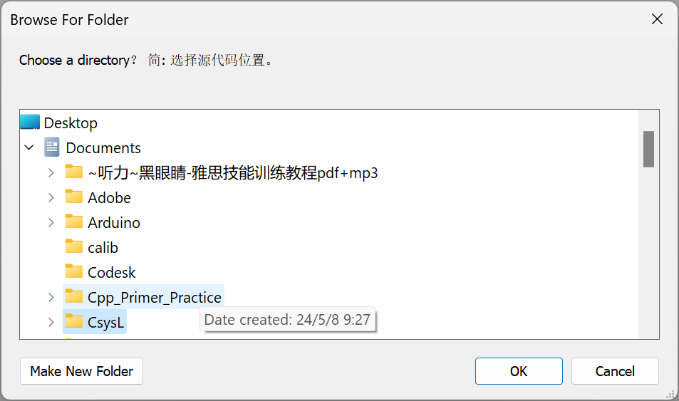
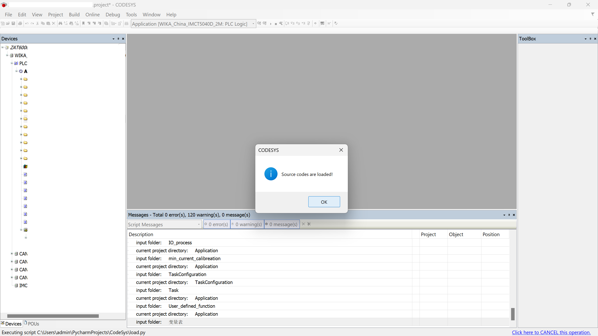

# CodeSys

## 使用方法:

在 CodeSys 软件内执行脚本。

1. 菜单执行

`export.py`:

1. 选择脚本
   
2. 选择要导出的代码（目录），留空为整个目录
   
3. 选择文件夹（导出到）
   
4. 文件夹非空提示，是否删除其中的文件
   
5. 结果信息
   

`load.py`:
1. 选择脚本
   
2. 选择文件夹（从导入）
   
3. 结果信息
   

## 脚本说明:

`export.py`:

- [x] 将 Codesys 内的 ST 语言的文本代码 和 Global_var, Textlist 和 Task_Configuration, library 备份到 Save_Folder 文件夹。
- [x] 将指定的文件夹内的 文本代码 备份到 Save_Folder 文件夹，不指定则为工况全部的文本代码。
- [x] 若 Save_Folder 文件夹 非空，则提示要删除其中文件，但不包括 `.git` 与 `.svn` 文件。
- [ ] 如果文件夹内存在 .git 文件,则将文件夹更新到 HEAD 。
  
`load.py`:
- [x] 将上述文件夹内文本代码的导入到当前工程。
- [ ] 设备文件夹/文件导入。
  
## 问题:

- 除ST语言的文本外,其他如: Visu,imagePool, VisuConfiguration, Project Settings, Project Infomation 没有导出.
- GlobalTextList 会丢失 ID Column 的数据.

## 致谢:

- [`CODESYS Online Help`](https://help.codesys.com/webapp/System;product=ScriptEngine)
- [`18thCentury/CodeSys`](https://github.com/18thCentury/CodeSys)